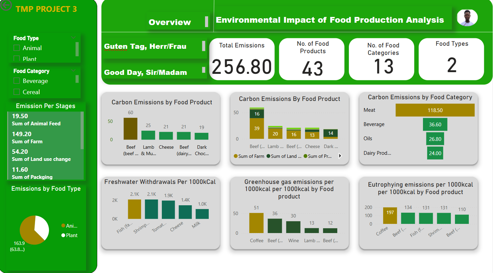
<a name="readme-top"></a>

<div align="center">
  <h1><b>Environmental Impact of Food Production Analysis</b></h1>
</div>

<!-- TABLE OF CONTENTS -->

# 📗 Table of Contents

- [📗 Table of Contents](#-table-of-contents)
- [Project Description ](#Food-Production-Analysis)
  - [🛠 Built with ](#-built-with-)
    - [Tech Stack ](#tech-stack-)
  - [Key Insights ](#key-features-)
  - [💻 Getting Started ](#-getting-started-)
    - [Prerequisites](#prerequisites)
    - [Setup](#setup)
  - [👥 Authors ](#-authors-)
  - [🤝 Contributing ](#-contributing-)
  - [⭐️ Show your support ](#️-show-your-support-)
  - [🙏 Acknowledgments ](#-acknowledgments-)
  - [📝 License ](#-license-)

<!-- PROJECT DESCRIPTION -->

# Food-Production-Data-Analysis <a name="about-project"></a>

**Food-Production-Data-Analysis** Food production is a critical sector that sustains human life, but it also significantly impacts the environment. The agricultural sector is responsible for greenhouse gas (GHG) emissions, deforestation, water depletion, and biodiversity loss. With rising global populations and increasing food demand, there is a pressing need to understand and mitigate the environmental impact of food production. This project aims to analyze key environmental metrics, including carbon emissions, water usage, land use, and biodiversity loss, to provide insights that can help in decision-making for sustainable food systems.

1. **Food product**: Name of the food product being analyzed.
2. **Animal Feed**: Carbon emissions (kgCO₂eq) from producing animal feed per unit of food production.
3. **Farm**: Carbon emissions (kgCO₂eq) generated directly from farming activities.
4. **Processing**: Carbon emissions (kgCO₂eq) from food processing and manufacturing.
5. **Transport**: Carbon emissions (kgCO₂eq) from transporting food products.
6. **Packaging**: Carbon emissions (kgCO₂eq) from packaging materials and processes.
7. **Retail**: Carbon emissions (kgCO₂eq) from food retail operations.
8. **Total_emission**: Total greenhouse gas emissions (kgCO₂eq) for each food product.
9. **Greenhouse Gas Emissions**: Greenhouse gas emissions from different stages of food production (e.g., farming, transportation, processing).
10. **Water Usage**: Freshwater withdrawals and scarcity-weighted water use.
11. **Land Use**: Type of holiday event
12. **Eutrophication Potential**: The contribution of food production to nutrient pollution in water bodies.

## 🛠 Built With <a name="Technologies Used"></a>
To guide this project, I will be using the CRISP-DM (Cross-Industry Standard Process for Data Management). There are 6 stages in this framework, namely: business understanding, data understanding, data preparation, modelling, model evaluation, and model deployment. This project utilized the first five stages of the framework. It also involved a variety of technologies, programming languages, and libraries to process, analyze, and visualize the data. The following tools were utilized:

4. _Python_: Python programming language was the backbone of the project, used for data processing, analysis, and visualization tasks.
5. _Pandas_ and NumPy: Pandas and NumPy libraries were essential for data manipulation and numerical computations.
6. _Matplotlib and Seaborn_: Matplotlib and Seaborn were employed for data visualization, creating insightful charts and graphs to represent the findings.
7. _Visual Studio Code and Jupyter Notebooks_: Jupyter Notebooks within the Visual Studio IDE provided an interactive environment for running code, visualizing data, and documenting the analysis process.
8. _scipy_: SciPy is a free and open-source Python library used for scientific computing and technical computing. Scipy contains modules for optimization, linear algebra, integration, interpolation, special functions, FFT, signal and image processing, ODE solvers and other tasks common in science and engineering.
9. _GitHub_: GitHub served as the version control system for the project, enabling collaboration and tracking changes in the codebase.
    These technologies played a crucial role in the successful implementation of the project, providing the necessary tools to analyze and derive insights from the time series data.
10. _PowerBI_: Power BI simplifies data visualization and reporting, making it easier for businesses to analyze and understand their data for better decision-making.

<details>
  <summary>Data Sources</summary>
  <p>The foundation of any data analysis lies in the quality and structure of the dataset. For this project, I am using a dataset that contains environmental impact metrics for various food products. The dataset contains 43 most common foods grown across the globe and 23 columns as their respective lands, water usage, and carbon footprints.</p>
</details>


<details>
<summary>Language</summary>
  <ul>
    <li><a href="">Python</a></li>
  </ul>
</details>


<p align="right">(<a href="#readme-top">back to top</a>)</p>
<!-- Features -->

## Key Performance Indicators (KPIs) <a name="key-features"></a>
To measure success, the project will use the following KPIs:
- Total and per-unit carbon emissions per food type
- Water footprint per kilogram of food produced
- Land usage per food product and its impact on biodiversity
- Identification of low-impact food alternatives
- Impact assessment of proposed sustainability recommendations

## Exploratory Data Analysis <a name="key-Insights"></a>
xploratory Data Analysis (EDA) is the heart of any data-driven project — it’s where the story begins to unfold. With the data cleaned and structured, I set out to uncover patterns, outliers, and relationships that could help answer the critical questions defined in the business understanding phase.To ensure a thorough exploration, I structured my analysis into three categories: univariate, bivariate, and multivariate analysis.
1. _Insights from data_:
   - Before diving into the analysis, I performed a thorough check for missing values. There were 14 columns with null values out of the 23 columns detected across the main environmental indicators. This was a heads-up for me on how I prepare my data for my analysis.
   - Presence of Duplicates: To ensure the integrity of the analysis, I checked for duplicate rows. Fortunately for me, there were no duplicates.
   - Presence of Outliers: Outliers were detected in several key variables, particularly in carbon emissions and land use. For example, beef and lamb showed extremely high values compared to other food products. Rather than removing these outliers, I retained them to preserve the authenticity of the environmental impact each product represents, since these values are real and relevant for sustainability discussions.
   - Normality of Datasets: Most of the variables did not follow a normal distribution, especially those related to emissions and water usage. These variables were right-skewed due to the extreme     environmental impacts of certain food products. Understanding this helped guide the selection of appropriate statistical methods (such as the Mann-Whitney U-test) for hypothesis testing later in the project.
2. _Univariate Analysis_:
 <h3>2. <em>Univariate Analysis</em></h3>

<p align="center">
  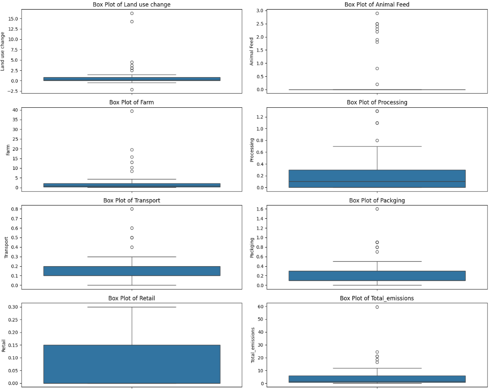
  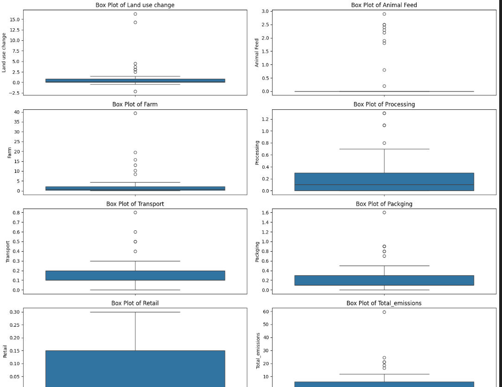
</p>

<p align="center">
  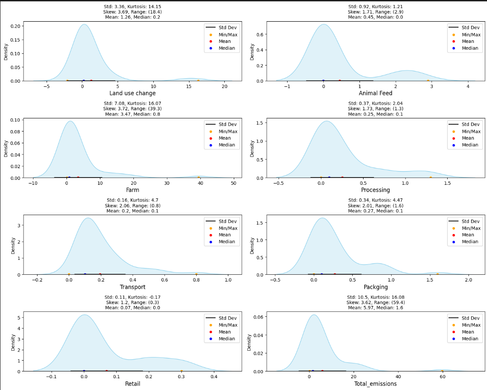
  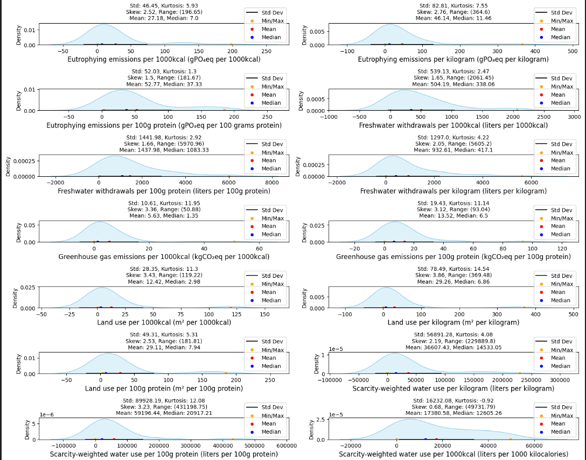
</p>


3. _Bivariate Analysis_:
 <h3>3. <em>Bivariate Analysis</em></h3>

<p align="center">
  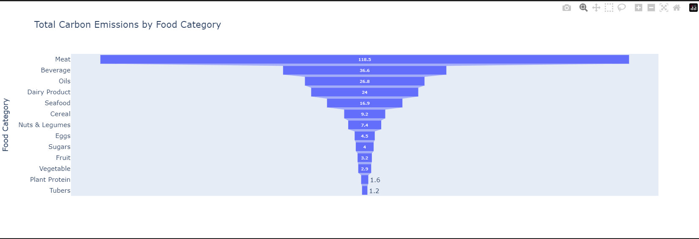
  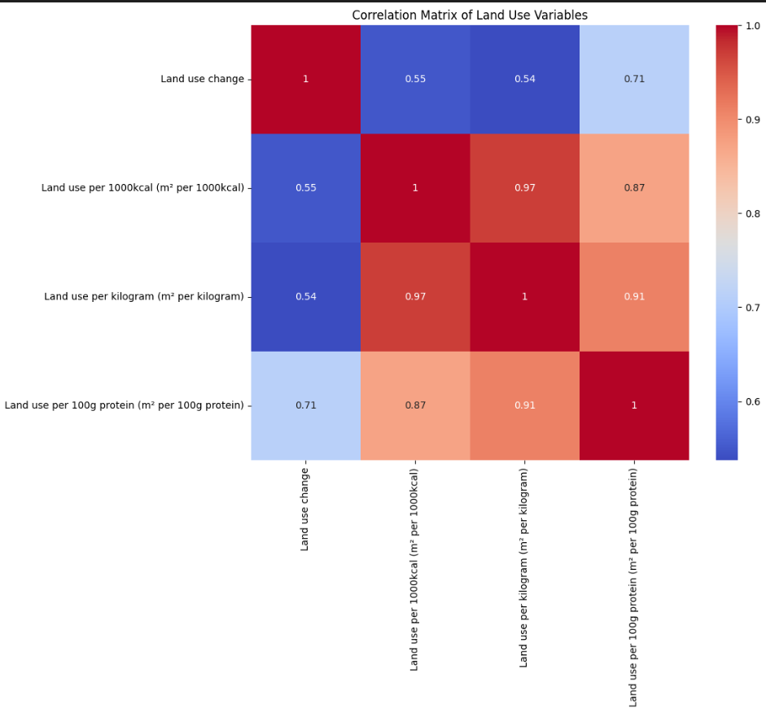
</p>

<p align="center">
  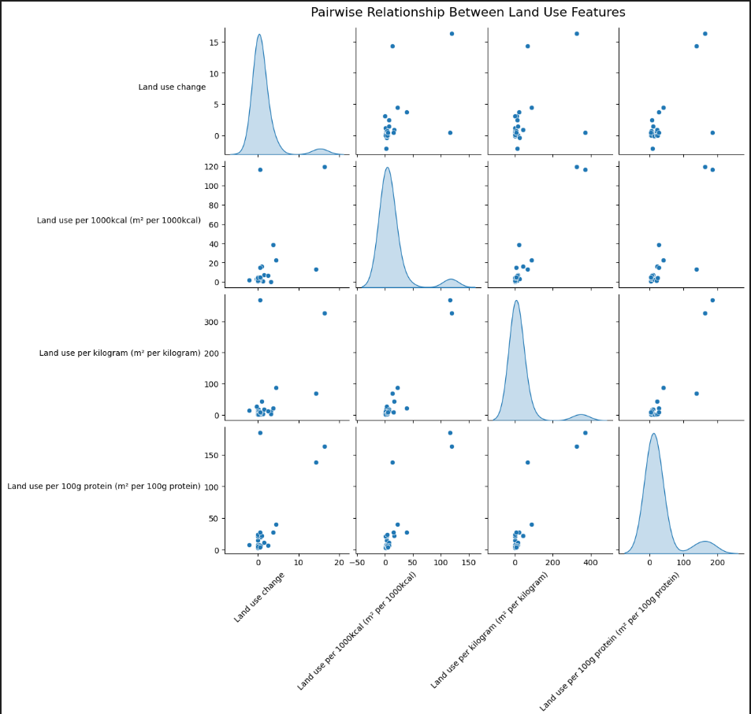
  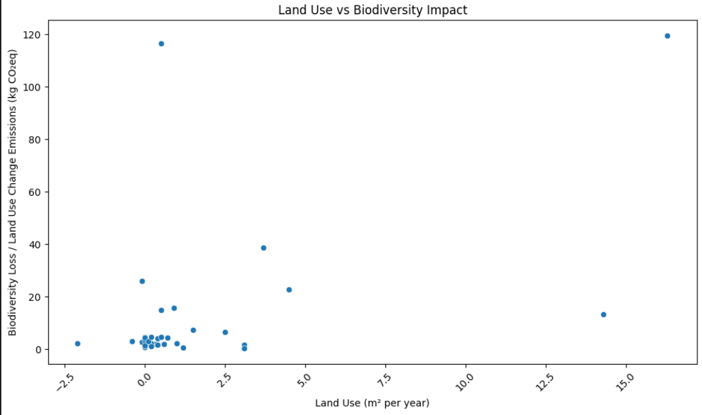
</p>


4. _Food Categories by Carbon Emissions_:
   

   - From the analysis, meat production emerges as the leading contributor to carbon emissions, accounting for approximately 118.5 kgCO₂eq, followed by beverage production at 36.6 kgCO₂eq, and oils at 26.8 kgCO₂eq.
   -  In contrast, fruit, vegetables, plant-based proteins, and tubers exhibit significantly lower carbon footprints. These findings highlight a clear opportunity to shift both production and consumption patterns toward more environmentally friendly food categories. Promoting low-emission foods can lead to substantial reductions in the overall carbon footprint of our diets.

5.  _How do different stages of food production contribute to total emissions?_:
   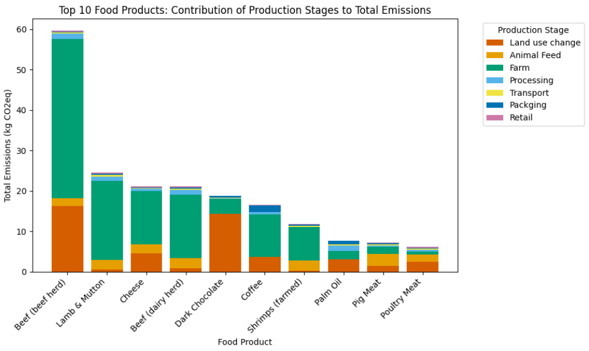

   -The major contributors to carbon emissions in food production are farming, land use change, and animal feed, while downstream stages like processing, transport, and packaging have a lesser impact

   - To reduce environmental harm, efforts should prioritize sustainable agricultural practices, land use optimization, and eco-friendly animal feed alternatives. Although downstream emissions are lower, improvements in energy efficiency and packaging sustainability can enhance the overall impact. Policy support and conscious consumer choices will also be critical in promoting a more sustainable food production system.
   
6. _How does water usage vary across different food types and production methods?_:
   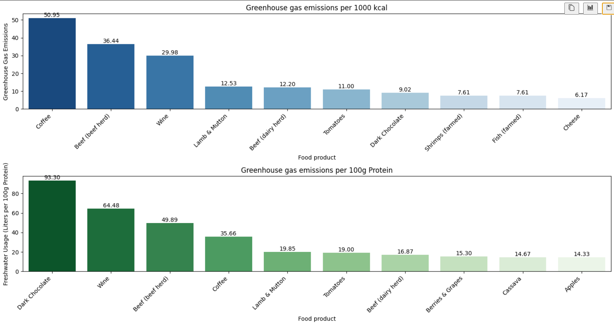

   - The visualization highlights the total volume of freshwater withdrawals across various food products. Notably, farmed fish and shrimp require substantial amounts of water to maintain aquatic environments, making efficient aquaculture systems, such as recirculating aquaculture systems (RAS), essential for sustainable production.Similarly, high-irrigation crops like tomatoes, berries & grapes, brassicas, and nuts, along with animal-based products such as milk, cheese, and beef, consume significant water resources due to direct usage and the intensive water demands of feed production. Given that freshwater represents only about 3% of the Earth’s total water supply, and much of it is not readily accessible, the need for sustainable water management in agriculture becomes urgent.

   - Promoting Sustainability in Water Use:
    - Adoption of Precision Irrigation: Techniques such as drip irrigation, soil moisture sensors, and smart water scheduling can drastically reduce water waste in crop production.
    - Aquaculture Innovations: Encouraging the use of water-recycling systems and improved filtration in aquaculture can reduce water demand without compromising yield.
    - Crop Diversification & Substitution: Promoting the cultivation and consumption of low water-footprint crops in water-stressed regions can reduce strain on freshwater sources.
    - Sustainable Livestock Practices: Supporting alternative feed sources and grazing methods that require less water can improve the efficiency of animal farming.
    - Policy and Education: Governments and stakeholders must enforce regulations on water usage, invest in irrigation infrastructure, and educate farmers and consumers on responsible water consumption.

6. _Conclusion_:
  - This analysis has provided critical insights into the environmental impact of food production using a data-driven approach guided by the CRISP-DM framework. By exploring key sustainability indicators such as carbon emissions, land use, and water consumption, we’ve identified patterns that emphasize the disproportionately high environmental cost of animal-based food products compared to plant-based alternatives.

  - Through comprehensive exploratory data analysis, feature engineering, and insightful visualizations, we highlighted the top contributors to carbon emissions — particularly meat, beverages, and oils — while also revealing the efficiency and sustainability of food categories like fruits, vegetables, and plant-based proteins.

  - Our findings underline the urgency of transitioning towards sustainable agricultural practices and informed consumption patterns. Strategies such as promoting plant-forward diets, optimizing land use, reducing animal feed emissions, and empowering consumers with clear eco-labels can drive meaningful environmental change.


<p align="right">(<a href="#readme-top">back to top</a>)</p>


<!-- GETTING STARTED -->

## 💻 Getting Started <a name="getting-started"></a>


To get a local copy up and running, follow these steps.

### Prerequisites

In order to run this project you need:

- Python


### Setup

Clone this repository to your desired folder:


```sh
  cd my-folder
  git clone https://github.com/adubrightkwartengsnr/Environmental_Impact_Of_Food_Production_Analysis
```

Change into the cloned repository

```sh
  cd Environmental_Impact_Of_Food_Production_Analysis
  
```

Create a virtual environment

```sh

python -m venv env

```

Activate the virtual environment

```sh
    env/Scripts/activate
```


### Install

Here, you need to recursively install the packages in the `requirements.txt` file using the command below 

```sh
   pip install -r requirements.txt
```


<!-- AUTHORS -->

## 👥 Authors <a name="authors"></a>

🕵🏽‍♀️ **Bright Adu Kwarteng Snr**

- GitHub: [GitHub Profile](https://github.com/adubrightkwartengsnr)
- LinkedIn: [LinkedIn Profile](www.linkedin.com/in/bright-adu-kwarteng-snr)

<p align="right">(<a href="#readme-top">back to top</a>)</p>

<!-- FUTURE FEATURES -->

## 🔭 Future Steps <a name="future-steps"></a>
As a next step, future analyses can incorporate broader factors like regional agricultural practices, consumer behavior, and policy impact to further enhance sustainability recommendations
    
<p align="right">(<a href="#readme-top">back to top</a>)</p>

<!-- CONTRIBUTING -->

## 🤝 Contributing <a name="contributing"></a>

Contributions, issues, and feature requests are welcome!

Feel free to check the [issues page](../../issues/).

<p align="right">(<a href="#readme-top">back to top</a>)</p>

<!-- SUPPORT -->

## ⭐️ Show your support <a name="support"></a>

If you like this project kindly show some love, give it a 🌟 **STAR** 🌟

<p align="right">(<a href="#readme-top">back to top</a>)</p>

<!-- ACKNOWLEDGEMENTS -->

## 🙏 Acknowledgments <a name="acknowledgements"></a>

I would like to express my sincere gratitude Azubi Africa, GitINNOtized GH for their unwavering support, and to my instructors for their invaluable mentorship throughout the course of this project. Their expertise, dedication, and commitment to our learning journey have been instrumental in shaping our understanding and skills in data analysis.

I would also like to extend a special thank you to Glen Nii Noi Anum for his valuable advice and insights shared during the development of this project. His experiences and expertise in similar projects have been a source of inspiration and guidance, enriching my project with practical knowledge.


<p align="right">(<a href="#readme-top">back to top</a>)</p>

<!-- LICENSE -->

## 📝 License <a name="license"></a>

This project is [MIT](./LICENSE) licensed.

<p align="right">(<a href="#readme-top">back to top</a>)</p>

<p> align="right">(<a href="https://medium.com/@adubrightkwarrteng11/environmental-impact-of-food-production-data-analysis-d768d1267dc7">Link to Article</a>)</p>


